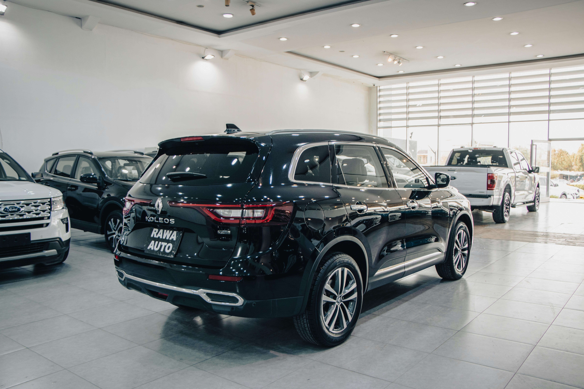

# Car-Sales([live project](https://app.powerbi.com/links/UxoaFkyT3M?ctid=ae6b8ae8-c4ed-48a6-90ac-578b536f4451&pbi_source=linkShare))

## Introduction 
The objective of this project was to find the most bought cars and the colors that customers prefer. 
Dax Were highly utilized.
## Problem Statement

1. Sales Overview, Calculate 
    - YTD Total sales.
    - MTD Total sales. 
    - YOY Growth in Total Sales.
    - Difference between YTD sales and PYTD sales.

2.  Average Price Analysis
    - YTD Average price 
    - MTD Average Price
    - YOY growth in Average
    - Difference between YTD Average price and PTYD Average Price.
  
3. Cars Sold Metrics 
    - YTD cars sold
    - MTD cars sold 
    - YOY Growth in Cars sold 
    - Difference between YTD cars sold and PYTD cars sold

## Data Sourcing and transformation
Data was efficiently cleaned and transformed with the power Query Editor. The screenshot below shows some of the steps taken during this process of.

## Data Modeling 
Since it was a time-based analysis the first step was to create a calendar table to better establish a relationship with the other table.

Then I went ahead to connect the original table and the calendar table with the common column being the date and formed a one-to-many relationship.

##  Visualization

In this visualization DAX measures where highly utilized, Buttons were also used to make the dashboard navigation user friendly.

## Analysis and Conclusion
According to the analysis, the best-selling companies are Chevrolet and Ford,
The most bought color is pale white for all the cars, especially the SUVs 
Scottsdale, Austin, And Janesville are the top 3 best-selling regions.
The cars with automatic transmissions sell more than the ones with manual transmissions which makes sense since people today prefer automatic over manual ones.

## Recommendation
1. Highlight the Stars: Chevrolet and Ford are leading the pack as the best-selling brands. center advertising campaigns around these models, showcasing their standout features and what makes them top choices among customers.

2. Spotlight Popular Colors: Pale white is the go-to color for most buyers, especially for SUVs.  make sure the ads prominently feature vehicles in this popular shade, drawing in customers who have a preference for it.

3. Target Hot Regions: Scottsdale, Austin, and Janesville are our top-performing regions. Tailor the marketing strategies to resonate with local tastes and preferences, maximizing our impact in these key areas.

4. Promote Automatic Convenience: Automatic transmissions are in higher demand compared to manual ones. The campaigns should emphasize the convenience and ease of automatic cars, educating buyers on their benefits and making them the preferred choice.

5. Host Family Fun Days: Families with kids love SUVs for their comfort and space. Let’s organize family-oriented events where they can experience these vehicles firsthand. Interactive and engaging experiences will highlight the features and advantages, making it an enjoyable and informative outing for all.

